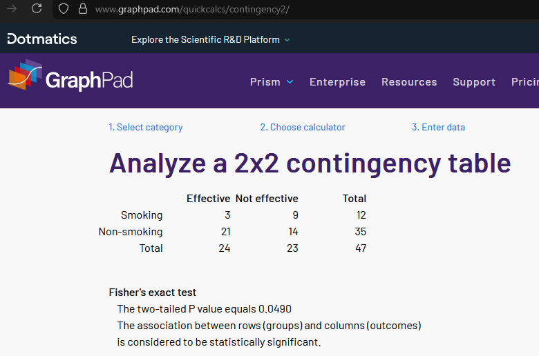

# Using Biofeedback to Promote Behaviour Change in Health Interventions: an Integrative Review #

Rebecca Kerstens, Gilly A. Hendrie, Caitlin A. Howlett, Yi Jin Liew, Naomi Kakoshke\
(please direct code enquiries to Yi Jin, and praise to everyone else).

## Intro and disclaimer ##

This README aims to explain the code used to perform *p* value calculations, and generate all the figures used in this manuscript.

Unfortunately the R scripts are a bit hard to run without the prerequisite dependencies (and it's a bit finicky). HTML outputs are provided for a quick visual check--with the catch being, there's no easy way to view HTML on GitHub anymore. Clicking on a HTML file produces plaintext (much wow), but there's a download button in the top-right hand corner of the page. Once saved locally, the HTML page can be viewed in a browser, in its full image-containing glory.

Another way would be to `git clone` this repo locally, but with only two HTML files in this repo... probably easier to manually click the download button.

And since there weren't that many moving parts, we (well, YJL) opted to place everything in a repo with no subfolders. Sorry. Your desktop's probably in a similar boat, no? :)

## *p* value calculations ##

Two-tailed Fisher's exact tests were carried out to determine whether a factor X leads to more effective/ineffective interventions.

Let's use an actual example to illustrate this process.

There were 47 studies in our integrative review. 24 were deemed effective and 23 deemed ineffective in health promotion efforts. This is the universe we're dealing with--with roughly equal chance of success and failure (ok fine--51% chance of success and 49% chance of failure).

For smoking cessation, there were 12 studies in total. 3 were effective, 9 were ineffective (3/12 = 25% success rate) in leading to healthier behaviour.

Using an online Fisher's exact calculator (https://www.graphpad.com/quickcalcs/contingency1/) to illustrate the setting up of this 2x2 matrix, and the results after clicking on "Calculate"...

(Note: numbers for the "non-smoking" row is deduced from subtracting the respective totals from the smoking row.)

This process is repeated for everything in Supplementary Table S3. But if you'd had had a look at the table, you'd come to the same conclusion that manually typing everything into an online calculator is sanity-sapping. This is where the Python script in this repo, `fishers_exact_within_row.py` comes to the rescue. This script is able to compute EVERYTHING in one go, by assuming each line corresponds to one factor.

Again, to make things less abstract, we provide `mean_ages.tsv` as an example input. The first two columns are "# effective" and "# ineffective", i.e., 3 and 9 for smoking; next two columns are "total effective" and "total ineffective", which is, unsurprisingly, 24 and 23 respectively. The output `mean_ages.pvals.tsv` is produced by running this one-liner on the command-line:

`$ fishers_exact_within_row.py mean_ages.tsv --wxno --corr none > mean_ages.pvals.tsv`

Which makes *p* value computation copy-pasting values from Supplementary Table 3 into the tsv file (Excel reads/saves tsv files fine btw, don't listen to Excel haters), running the script, then copying the column of *p* values back into the sheet. Et voila.

## Figure generation ##

Fig 1 was a ~~masterpiece~~ figure created in Powerpoint.

Fig 2 was generated with the R script `01_plot_fig2.R`. If you `git clone`-d the repo and wanted to test the code out, make sure the working directory is set correctly. R sucks in this regard. Yeah yeah I know there's a library to help define local directories, but honestly, this should be a base-language feature. *\*grumble\**

Fig 3 was, unsurprisingly, generated with the R script `02_plot_fig3.R`.

Feel free to view the HTML instead of downloading the R scripts, using the aforementioned method of finding the download button & view the file locally.

Post-processing of figures (moving subfigures to where they should go, making A B C D E bigger and stand out more, plus prettying things) was done with Affinity Designer v1.1, as Adobe's gotten too dang pricey. Affinity's now free apparently, after getting acquired by Canva. This new Affinity (v2) can open older files--i.e., you can open and view the `*.afdesigner` files in this repo, but you can't save it back into the old v1 format. Planned obsolescence, hooray.

But to facilitate things, as usual--figures have been exported in the `*.png` format, and clicking on them in this repo *should* show the pictures, no fancy tricks required.
